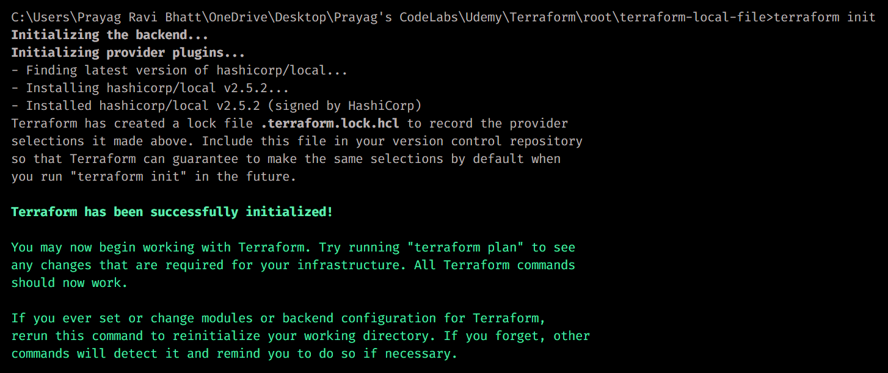
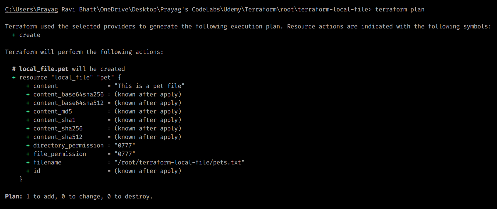
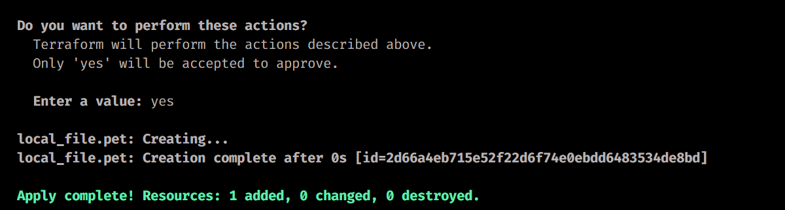
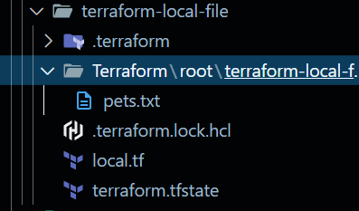
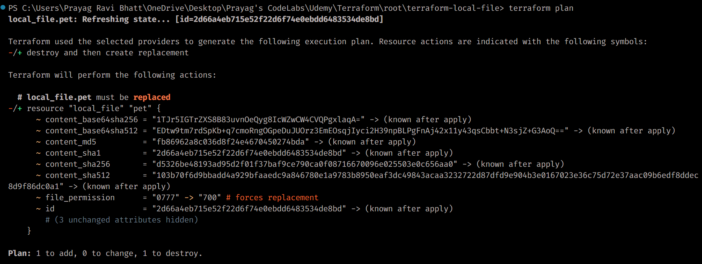
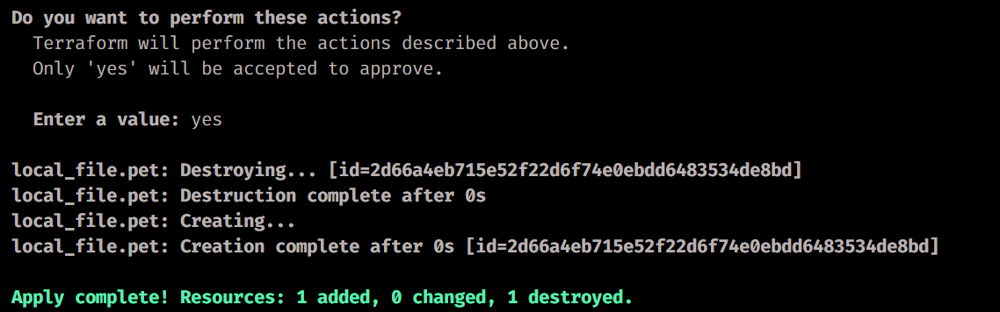

# Terraform Notes [Revision]

## Theory:

### What is Terraform?

Terraform is an infrastructure as code (IaC) tool developed by HashiCorp that enables you to safely and predictably create, change, and improve infrastructure. It codifies infrastructure in configuration files that describe the topology of cloud resources.

### Core Concepts:

- **Infra Provisioning Tool**: Terraform allows you to define and provision infrastructure resources across various cloud providers and services through code rather than manual processes.

- **Declarative Language**: Unlike imperative programming where you specify how to achieve a result, Terraform uses a declarative approach where you specify what you want, and Terraform handles the implementation details to reach that desired state.

- **Open Source**: Terraform's core functionality is available as open-source software, allowing for community contributions, transparency, and flexibility in implementation.

### Key Benefits:

- **Multi-Cloud Deployment**: Works consistently across multiple cloud providers
- **Infrastructure Versioning**: Track changes to infrastructure like code
- **Resource Graph**: Understands resource dependencies for proper provisioning order
- **Change Planning**: Preview changes before applying them
- **Modularity**: Reuse configurations across projects

### Terraform vs Other IaC Tools:

| Feature          | Terraform           | CloudFormation | Ansible     |
| ---------------- | ------------------- | -------------- | ----------- |
| Language         | HCL                 | JSON/YAML      | YAML        |
| State Management | External state file | AWS-managed    | Stateless   |
| Cloud Support    | Multi-cloud         | AWS only       | Multi-cloud |
| Execution        | Agent-less          | AWS service    | Agent-less  |

### Terraform Workflow:

The Terraform workflow represents the core operational model of how Terraform transforms infrastructure code into deployed resources:

1. **Write Infrastructure Code**

      - Define desired infrastructure state in HCL files
      - Organize code into modules for reusability
      - Specify provider configurations

2. **State Management Process**

      - Convert current state to desired state -> HCL handles the rest
      - Terraform creates an execution plan based on the desired state
      - Terraform builds a dependency graph of all resources
      - Terraform plans resource creation in the correct order

3. **Resource Lifecycle Management**

      - Terraform creates resources according to the plan
      - Terraform stores resource state in `terraform.tfstate`
      - Terraform compares current state with desired state for updates
      - Terraform updates resources in the proper order
      - Terraform can destroy resources in the correct order

4. **Collaboration & Maintenance**
      - State locking prevents concurrent modifications
      - Remote backends enable team collaboration
      - Version control tracks infrastructure evolution

### Key Components:

- **Providers**
- **Resources**: AWS, Azure, GCP, Docker, Kubernetes, etc.
- **HCL** (HashiCorp Configuration Language)
- **Terraform CLI**

### Resource Categories:

- Compute
- Storage
- Networking
- Security
- Monitoring
- Database

### Resource Types Examples:

1. Local File Type
2. Random ID

### HCL Structure:

1. Blocks
2. Arguments

```hcl
<block> <argument> {
    key1 = value1
    key2 = value2
}
```

---

### Terraform Workflow Steps:

1. ## 1. Initialize: `terraform init`

      - Downloads the provider plugins
      - Initializes the working directory
      - Initializes the backend
      - Creates the `.terraform.lock.hcl` file

      

2. ## 1. Plan: `terraform plan`

      - Creates an execution plan showing what actions will be performed

      

3. ## 1. Apply: `terraform apply`

      - Executes the plan and creates resources
        
           - File gets created
             

4. ## 1. Show: `terraform show`

      - Displays the current state
        

5. ## 1. Update Infrastrucuture

      - **Update the permissions of the file -> file_permission = "0700"**
      - 
        

6. ## 1. Destroy: `terraform destroy`
      - Removes all resources managed by the current configuration
      - Analyzes state file to determine the destruction sequence
      - Provides a confirmation prompt before proceeding
      - Updates state file after successful destruction

---

### Providers:

- **Official Providers**: AWS, Azure, Google Cloud, Docker, Kubernetes, etc.
- **Partner Providers**: Datadog, New Relic, PagerDuty, DigitalOcean, Heroku
- **Community Providers**: Active Directory, Cloudflare, GitHub, etc.

### Terraform File Structure:

- **main.tf**: Contains the primary infrastructure configuration code
- **variables.tf**: Defines input variables used across configurations
- **outputs.tf**: Specifies outputs to display after applying changes
- **provider.tf**: Contains provider-specific configurations
